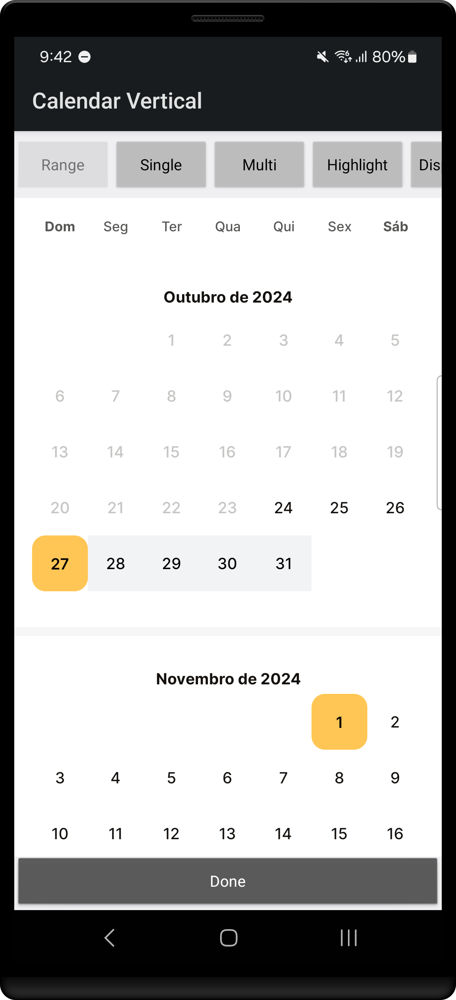

Android Calendar Vertical
==========================

Standalone Android widget for picking dates from a calendar view in vertical layout.




Usage
-----

Include `CalendarVertical` in your layout XML.

```xml
<you.thiago.calendarvertical.CalendarVertical
    android:id="@+id/calendar_view"
    android:layout_width="match_parent"
    android:layout_height="match_parent"
    />
```

This is a fairly large control so it is wise to give it ample space in your layout. On small
devices it is recommended to use a dialog, full-screen fragment, or dedicated activity. On larger
devices like tablets, displaying full-screen is not recommended. A fragment occupying part of the
layout or a dialog is a better choice.

In the `onCreate` of your activity/dialog or the `onCreateView` of your fragment, initialize the
view with a range of valid dates as well as the currently selected date.

If the Calendar instance was not explicitly initialized, it will be **auto init** into **Rage mode** with one year from current date as min and max dates.
Auto init mode can be disabled direct on XML layout with `app:calendarvert_autoInit="false"` and Range mode can be set on XML with `app:calendarvert_mode="single"`.

```kotlin
val calendar = findViewById<CalendarPickerView>(R.id.calendar_view)

val today = Calendar.getInstance()
val dates = ArrayList<Date>()

today.add(Calendar.DATE, 3)
dates.add(today.time)

today.add(Calendar.DATE, 5)
dates.add(today.time)

calendar.init(Date(), nextYear.getTime())
        .inMode(CalendarPickerView.SelectionMode.RANGE)
        .withSelectedDates(dates)
```

To setup the calendar instance without explicit initialization, you can use the following code:

```kotlin
val calendar = findViewById<CalendarPickerView>(R.id.calendar_view)

val today = Calendar.getInstance()
val dates = ArrayList<Date>()

today.add(Calendar.DATE, 3)
dates.add(today.time)

today.add(Calendar.DATE, 5)
dates.add(today.time)

calendar.build()
        .inMode(CalendarPickerView.SelectionMode.RANGE)
        .withSelectedDates(dates)
```

## Installation

Step 1. Add the JitPack repository to your build file

```groovy
allprojects {
  repositories {
    ...
    maven { url 'https://jitpack.io' }
  }
}
```

Step 2. Add the dependency

```groovy
dependencies {
  implementation 'com.github.thiago-you:android-calendar-vertical:1.0.0'
}
```

License
-------

    Copyright 2024, Inc.

    Licensed under the Apache License, Version 2.0 (the "License");
    you may not use this file except in compliance with the License.
    You may obtain a copy of the License at

       http://www.apache.org/licenses/LICENSE-2.0

    Unless required by applicable law or agreed to in writing, software
    distributed under the License is distributed on an "AS IS" BASIS,
    WITHOUT WARRANTIES OR CONDITIONS OF ANY KIND, either express or implied.
    See the License for the specific language governing permissions and
    limitations under the License.
